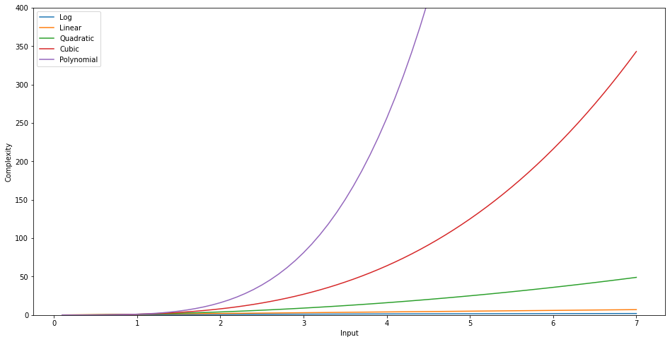

### Plotting different complexity functions

We have 5 different functions to plot and visualize the complexity with (Taking input n = 0-7 and polynomial power k = 4). 

1. Logarithmic
2. Linear
3. Quadratic
4. Cubic
5. Polynomial

After plotting them in the same plot and scaling, we get:

From the plot, it is visible that the sequence from fastest to slowest is repectively Logarithmic, Linear, Quadratic, Cubic and Polynomial. While logarithm and linear is almost similar due to small input values, cubic and polynomial is increasing very rapidly.

So Logarithmic complexity is the fastest one to have.

